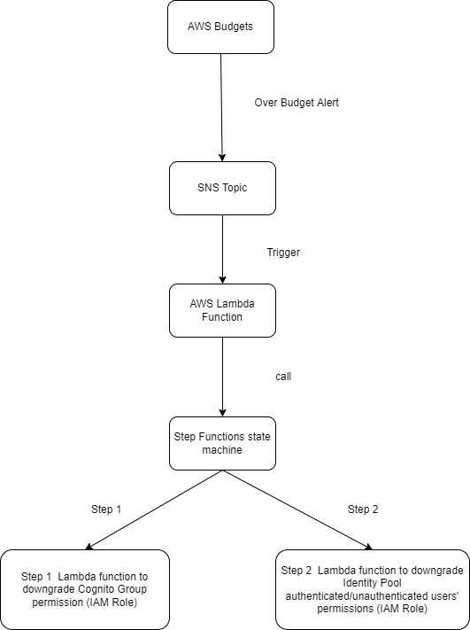

# AWS CDK TypeScript Demo for Over-Budget Workflow
This project demostrates setting up below AWS resources and workflow using CDK:



### Below AWS resources are setup in this project

* AWS Budget
* SNS Topic
* AWS Lambda function
* AWS Step functions
* all the required permissions and IAM Roles

## Setup 
To install AWS CDK, follow the instructions here: https://docs.aws.amazon.com/cdk/v2/guide/getting_started.html

## How To Deploy
To deploy, run:
   cdk deploy --parameters CognitoUserPoolId=<congito pool id> --parameters NameOfCognitoGroupToDowngrade=<cognito group you want downgraded> --parameters IdentityPoolId=<identity pool id>

## Budget Configuration
The budget can be configured by this line of code in [this file](./lib/aws_cdk_budget_watcher_handler-stack.ts):

```
    const cfnBudget = new budgets.CfnBudget(this, "Buget", {
      budget: {
        budgetType: 'COST',
        timeUnit: 'DAILY',
        budgetLimit: {
          amount: 2,
          unit: 'USD',
        },
        budgetName: 'MyBuget',
      },
      notificationsWithSubscribers: [
        {
          notification: {
            notificationType: 'ACTUAL',
            comparisonOperator: 'GREATER_THAN',
            threshold: 75, 
            thresholdType: 'PERCENTAGE'
          },
          subscribers: [
            {
              subscriptionType: 'SNS',
              address: overbudgetTopic.topicArn
            },
            ]
        }

      ]
    });
```
